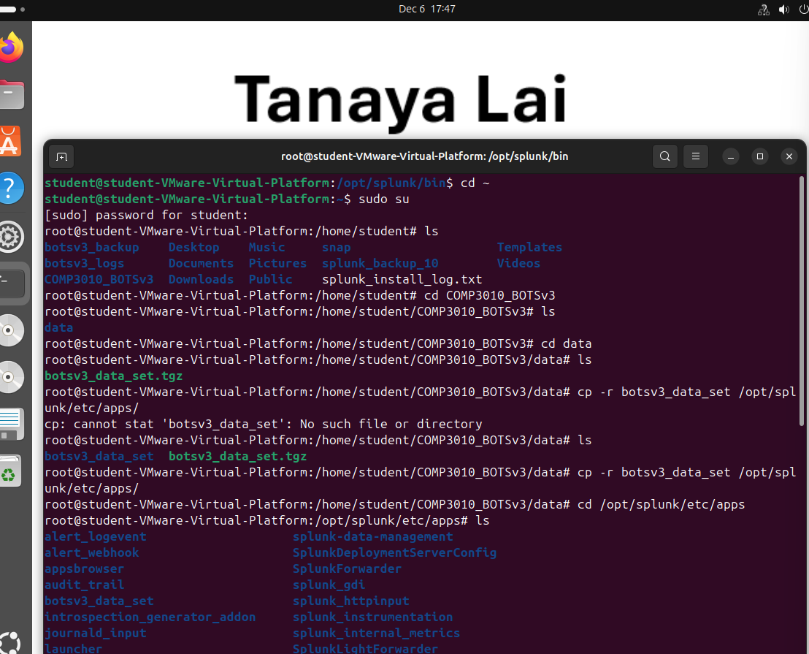
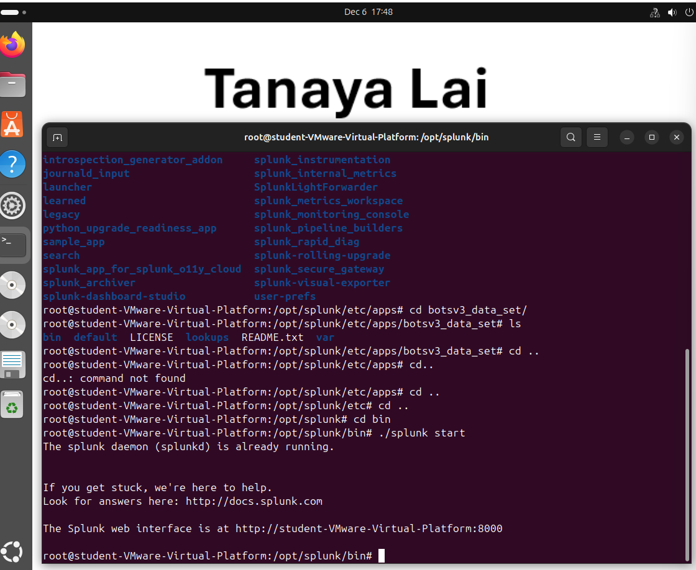
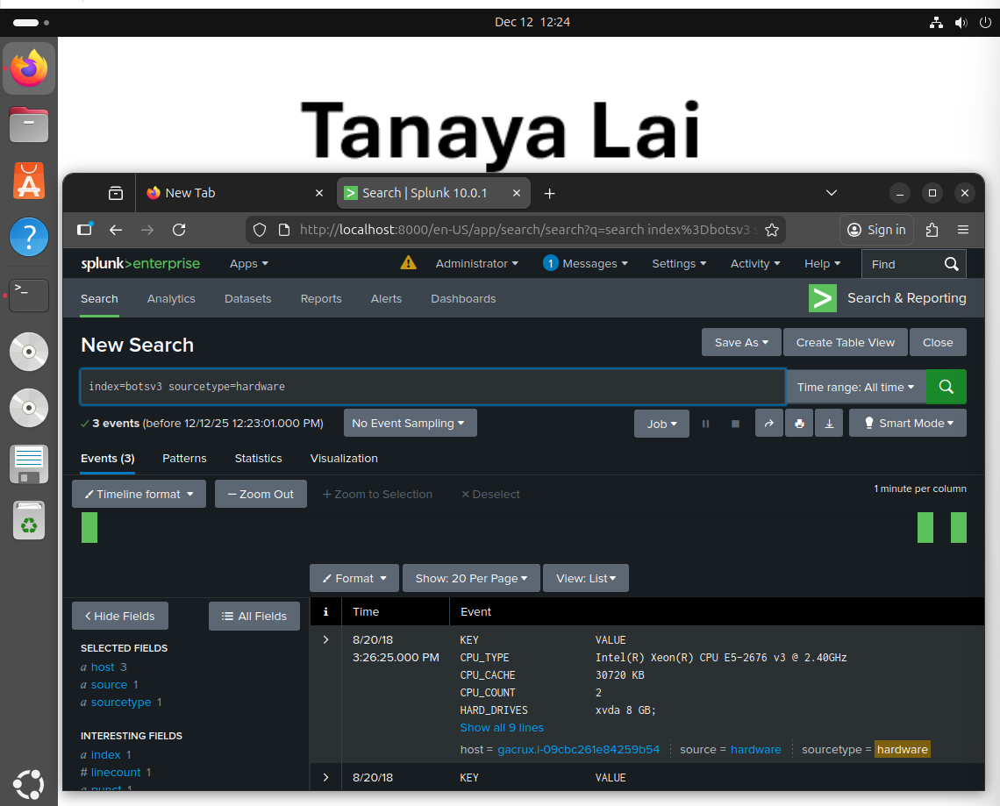

### Comp3010 Coursework2
 # BOTSv3 Incident Analysis

 ## Introduction
A Security Operations Centre (SOC) is responsible for detecting, analysing and responding to cybersecurity incidents in real time.  This investigation was conducted from the perspective of a SOC analyst using Splunk as a Security Information and Event Management(SIEM) platform to analyse data and identify misconfigurations, suspicious activity and potential risks within an enterprise environment [1].
 
The dataset used was the Boss of the SOC Dataset Version 3 (BOTSv3), a pre-indexed security dataset created by Splunk to simulate a realistic security incident inside a fictional organisation called “Frothly”. BOTSv3 provides various log sources including network, endpoint, email and cloud service logs focusing on AWS activity. Splunk’s Search processing Language (SPL) was used query and analyse these logs to investigate the attack and answer the selected set of guided 200-level BOTSv3 questions.

The main objective of this investigation was to demonstrate SOC analysis by identifying AWS user activity, detecting insecure cloud configurations, analysing endpoint system information, and explaining  the relevance of these findings  in terms of incident detection and response. The investigation also aims to establish how Splunk supports SOC workflows and incident handling lifecycles. 

The scope of this investigation was limited to questions 1–8 of the provided guided question set, using only the data available within the BOTSv3 dataset and does not include live threats or incident response in real time. It is assumed that the dataset is complete, accurate, and representative of Frothly’s operational environment during the simulated timeframe. All findings are based solely on the logs present within Splunk. 

This report presents the Splunk installation and dataset preparation, a reflection on the SOC roles and incident handling, the findings of the investigation supported by evidence. This report will demonstrate how Splunk can be used to support effective security monitoring and incident handling. 

 
 ## SOC Roles & Incident Handling Reflection
 A SOC is responsible for continuously monitoring, detecting, analysing and responding to cybersecurity incidents. SOC teams are normally organised into three tiers. Tier 1 focuses on monitoring alerts and detecting possible security incidents. Tier 2 performs a deeper analysis to the determine the root cause, potential impact and come up with strategies to fix those problems. Tier 3 deals with more difficult threats, responds to incidents and come up with mitigation strategies to prevent future incidents [2].
 
The BOTSv3 investigation is mostly conducted from the perspective of tier 1 and 2. Tier 1 responsibilities are reflected through the initial detection of security incidents using Splunk queries, such as such as identifying unusual AWS API activity, misconfigured S3 bucket permissions, and endpoint inconsistencies. Tier 2 responsibilities are reflected through the deeper analysis to determine the root cause, affected assets and potential impact of the incident. 

Incident handling methodologies primarily provide a structured lifecycle that aims to rectify an incident within an individual organisation [3]. One methodology is the National Institute of Standards and Technology(NIST) incident response lifecycle which consists of preparation, detection and analysis, containment, eradication and recovery and post-incident activity. Other examples include the Chairman of the Joint Chiefs of Staff Manual (CJCSM), which follows similar steps, highlighting the importance of a structured step based approach to response [3].

Prevention and preparation for incidents include compiling a list of IT assets, establishing which ones are important or hold sensitive data and defining normal behaviour [4]. Question 2 – API activity without MFA, aligns with this stage, as it requires you to identify the relevant field.

Detection and analysis involve identifying signs of future incidents and indicators of compromise[4]. In BOTSv3,  Question 1 – IAM user activity, and Question 4 – S3 public access event, align with this stage. Both these questions require recognising signs of incidents using CloudTrail logs and demonstrate how SOC analysts detect possible security breaches.

Response usually involves containment to stop the attack before it causes damage, identifying responsible users and establishing which assets have been affected[4]. Question 5 – Bud’s Username, and Question 6 – Name of the public S3 bucket, align with this stage by identifying the attacking host and affected asset. 

Finally, eradication and recovery focus on identifying all affected hosts, removing malware and restoring systems and operations [4]. In the BOTSv3 investigation, Question 7 – Name of text file, aligns with this stage as it requires you to confirm what data was affected to be able to know what data needs to be removed. Further analysis of all questions is provided in the Guided Questions section.

 ## Installation & Data Preparation
To complete the BOTSv3 questions, Splunk Enterprise was installed on an Ubuntu virtual machine to replicate a SOC SIEM environment. A Linux-based  virtual machine was chosen as Linux platforms are widely recognised in security operations due to their stability, security and integration flexibility with SIEM systems. These systems allow for secure log handling and centralised analysis, which reflect important SOC infrastructure practices [5].

Splunk was installed from the official Splunk website as the BOTSv3 GitHub repo recommended. The installation instructed to extract the dataset into the $SPLUNK_HOME/etc/apps directory. Therefore, the .tgz package was chosen instead of the .deb or .rpm package, which install software on a Linux system. The .tgz archive contains the requires dataset structure for Splunk ingestion which makes it the appropriate choice for this setup. In SOC environments, typically ingested as structured log files and archives rather than operating system installation packages, reinforcing this choice [6]. After installation was complete, access to the Splunk web interface was verified through the browser. 
 

 

The BOTSv3 dataset was downloaded from the Splunk BOTSv3 GitHub repository and deployed as a Splunk app, following the repository’s recommendation. This approach automatically configured all required indexes, source types and dashboards. By doing this, the dataset is ingested in an organised way and easy to follow which reflects the deployment of data sources by SOCs in real world environments. 
 

 

To validate that the dataset had been ingested properly and available for analysis, searches were performed across the BOTSv3 index to confirm the presence of events. This is shown below in figure 7, using the query “index=botsv3 earliest=0”. 

  

## Guided Questions 
### Q1 - List out the IAM users that accessed an AWS service (successfully or unsuccessfully) in Frothly's AWS environment? 

**Query:**

`index=botsv3 sourcetype=aws:cloudtrail userIdentity.userName =* 
| stats values(userIdentity.userName) as IAM_Users
| eval IAM_Users=mvsort(IAM_Users) 
| eval IAM_Users=mvjoin(IAM_Users,",")`

**Answer:**

`bstoll,btun,splunk_access,web_admin`
  

This finding supports the detection phase of the incident handling lifecycle by identifying IAM users involved in potentially suspicious AWS activity. It also supports the response stage of the lifecycle, as identifying users is essential when investigating and containing cloud based incidents.  
### Q2 - What field would you use to alert that AWS API activity has occurred without MFA (multi-factor authentication)? 

**Query:**

`index=botsv3 sourcetype=aws:cloudtrail 
| search NOT eventName=ConsoleLogin 
| search userIdentity.sessionContext.sessionIssuer.type =* 
| table _time, userIdentity.userName, userIdentity.sessionContext. attributes.mfaAuthenticated, eventName`

**Answer:**

`userIdentity.sessionContext.attributes.mfaAuthenticated`
  

This finding supports the preparation and prevention stage of the incident handling lifecycle as it establishes the key field needed to determine if API activity has occurred without MFA. Analyst can use the uncovered information to then consider possible attacks that could happen and produce appropriate response plans. 
### Q3 - What is the processor number used on the web servers?  

**Query:**

`index=botsv3 sourcetype=hardware`

**Answer:**

`E5-2676`
  

This finding aligns with the preparation and prevention stage of the incident handling lifecycle as it involves determining what assets exist and establishing a normal baseline of how the systems are configured. Analyst can use this information to then detect abnormal systems and unexpected changes. 
### Q4 - What is the event ID of the API call that enabled public access? 

**Query:**

`index=botsv3 sourcetype=aws:cloudtrail eventName=PutBucketAcl AllUsers
| table _time, eventID, userIdentity. userName, requestParameters,
responseElements, eventName`

**Answer:**

`ab45689d-69cd-41e7-8705-5350402cf7ac`
  

This finding supports the detection stage of the incident handing lifecycle as it involves finding and analysing the first sign of the incident which will then become critical when writing an incident report. 
### Q5 -	What is Bud's username? 

**Query:**

`index=botsv3 sourcetype=aws:cloudtrail eventName=PutBucketAcl AllUsers`

**Answer:**

`bstoll`
  
 
   

The SOC response stage of the incident handling lifecycle involves containing the attack before it causes damage. This is first done through identifying the attacking host, which is exactly what this finding identifies. The user has now been identified and actions such as disabling the account can be performed to contain the attack.
### Q6 - 6.	What is the name of the S3 bucket that was made publicly accessible? 

**Query:**

`index=botsv3 sourcetype=aws:cloudtrail eventName=PutBucketAcl userIdentity.userName=bstoll 
| table _time, requestParameters. bucketName, eventID`

**Answer:**

`frothlywebcode`
  

In the previous question the attacking host was identified. Following on from that, this finding also aligns with the response stage by identifying the affected asset which tells analysts what data is under threat, which systems need repairing and how serious the attack is. 
### Q7 - What is the name of the text file that was successfully uploaded into the S3 bucket while it was publicly accessible? 

**Query:**

`index=botsv3 sourcetype=aws: s3:accesslogs earliest=08/20/2018:14:01:46 latest=08/20/2018:14:57:54 
| search frothlywebcode 
| search txt 
| search REST.PUT. OBJECT`

**Answer:**

`OPEN_BUCKET_PLEASE_FIX.txt`
   

This finding aligns with the eradication and recovery stage as it determines if data was uploaded while  the S3 bucket was publicly accessible, if the incident was a data breach and the impact of the incident. This finding confirms data was uploaded and now means that the data can be eradicated. 
### Q8 - What is the FQDN of the endpoint that is running a different Windows operating system edition than the others?

**Query:**

`index=botsv3 
| stats count by sourcetype`

`index=botsv3 sourcetype=WinHostMon 
| stats values(os) by host` 

`index=botsv3 earliest=0 sourcetype=WinHostMon "windows 10" 
| stats count by OS, host 
| stats values(host) by os`

`index=botsv3 host=BSTOLL-L`

**Answer:**

`BSTOLL-L.froth.ly`
 
This finding supports the detection stage of the  incident handling lifecycle as it involves comparing OS editions, hosts and FQDNs to identify the anomalous endpoint. This question reveals an anomalous OS version which could indicate compromised hosts, unapproved systems or misconfiguration.

## Conclusion
The BOTSv3 Investigation revealed that an IAM bstoll made an API call which allowed public access to an S3 bucket called frothlywebcode, during a text file called OPEN_BUCKET_PLEASE_FIX.txt was successfully uploaded. This scenario highlights the risk of cloud misconfigurations and improper access controls.

Th exercise underlines key SOC, including the importance of centralised logging and establishing a normal or baseline knowledge of systems, users, OS versions, etc, to then be able to detect anomalies. This scenario also highlights the importance of a structured investigation plan such as an incident handling lifecycle that provides a step by step analysis to handle attacks. Real world SOC challenges are reflected through IAM abuse, cloud configuration errors and endpoint anomalies. 

Improvements for detection include enforcing compulsory MFA for IAM users and placing alerts on PutBucketAcl events, public S3 access changes and API activity without MFA. The response process could be improved by containing the incident immediately by revoking public bucket access and disabling compromised credentials. Learning from the events and feeding it back into the SOC processes and incident handling Lifecyle could be beneficial for post incident response. 

## References 
[1] M. Scapicchio, A. Downie, and M. Finio, “What is a Security Operations Center (SOC)?,” IBM, 2025. [Online]. Available: https://www.ibm.com/think/topics/security-operations-center. 

[2] M. Oguntoyinbo, “Cybersecurity: Mitigating the risk as SOC alert analyst and incident responder,” Theseus, 2025. [Online]. Available: https://www.theseus.fi/bitstream/handle/10024/893410/Oguntoyinbo_Mayowa.pdf?sequence=3. 

[3] M. Osorno, T. Millar, and D. Rager, “Coordinated cybersecurity incident handling: Roles, processes, and coordination networks for crosscutting incidents,” in Proc. 16th Int. Command and Control Research and Technology Symp. (ICCRTS), Québec City, QC, Canada, Jun. 21–23, 2011.

[4] Cynet, “NIST incident response: 4-step life cycle, templates and tips,” Cynet Unified, AI-Powered Security Platform for MSPs & SMEs, 2025. [Online]. Available: https://www.cynet.com/incident-response/nist-incident-response/. 

[5] Wafaicloud Team, “Linux secure SIEM integration best practices,” Wafaicloud Blogs, 2025. [Online]. Available: https://wafaicloud.com/blog/linux-secure-siem-integration-best-practices/. Accessed: 

[6] R. Kent and M. Souppaya, Guide to Computer Security Log Management, NIST Special Publication 800-92, Sep. 2006

   
   
 
